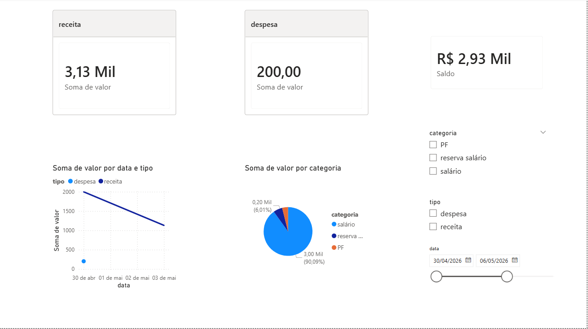

# Sistema de Controle Financeiro

Projeto desenvolvido em Python para auxiliar no controle de finanças pessoais através do registro de receitas e despesas.

## Funcionalidades

* Cadastro de receitas e despesas
* Listagem de transações
* Cálculo de saldo atual
* Edição de transações
* Remoção de transações
* Exportação de dados para Excel
* Análise financeira
* Gráfico de gastos por categoria
* Gráfico de receitas vs despesas
* Dashboard interativo no Power BI

## Tecnologias Utilizadas

* Python
* SQLite
* Pandas
* Matplotlib
* OpenPyXL
* Power BI
* Git
* GitHub

## Estrutura do Projeto

```text
controle_financeiro/
│
├── funcoes/
│   ├── __init__.py
│   ├── analise.py
│   ├── exportacao.py
│   ├── graficos.py
│   └── transacoes.py
│
├── dados.json
├── main.py
├── README.md
└── .gitignore
```

## Como Executar

### 1. Clonar o repositório

```bash
git clone https://github.com/pollyanamasiero/controle-financeiro.git
```

### 2. Entrar na pasta do projeto

```bash
cd controle-financeiro
```

### 3. Instalar as dependências

```bash
pip install pandas matplotlib openpyxl
```

### 4. Executar o sistema

```bash
python main.py
```

## Dashboard

O projeto também possui integração com Power BI para visualização dos dados financeiros por meio de dashboards interativos.



## Aprendizados

Durante o desenvolvimento deste projeto foram praticados conceitos como:

* Estruturas de repetição e condicionais
* Funções
* Manipulação de arquivos JSON
* Modularização de código
* Tratamento de exceções
* Análise de dados com Pandas
* Geração de gráficos com Matplotlib
* Versionamento com Git e GitHub
* Criação de dashboards no Power BI

## Melhorias Futuras

* Filtros por período
* Relatórios mensais
* Banco de dados SQLite
* Interface gráfica
* Dashboard web

---

Projeto desenvolvido para fins de estudo e prática de Python.
